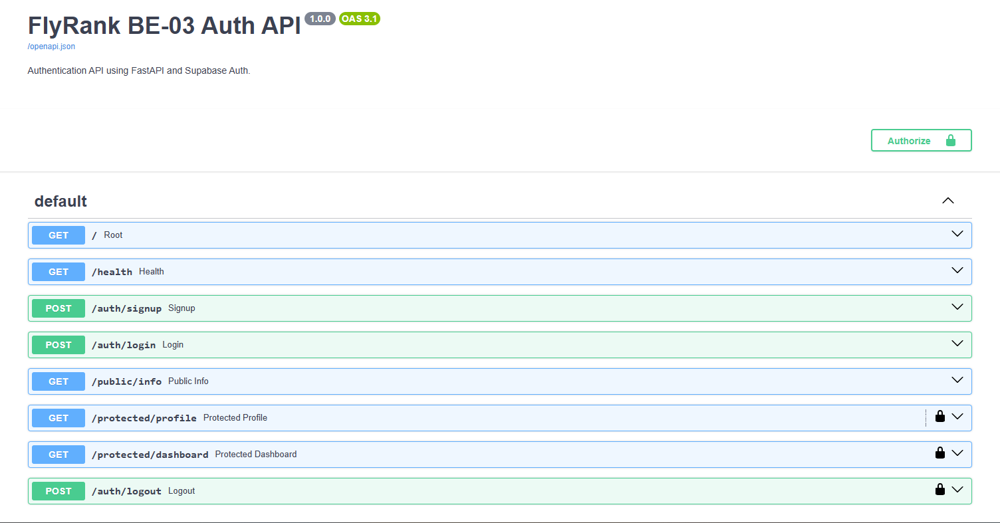

# BE-03: Authentication API

A REST API built with **FastAPI** and **Supabase Auth** for user registration, login, token verification, protected routes, and logout. This project was developed for the FlyRank Backend AI Engineering internship assignment.

## Features

* User signup with email and password
* User login with Supabase authentication
* Access and refresh token responses
* Public information endpoint
* Protected user profile endpoint
* Protected dashboard endpoint
* Bearer token verification
* Logout using the authenticated user's access token
* Request validation and consistent error responses
* Interactive API documentation with Swagger UI

## Tech Stack

* Python
* FastAPI
* Supabase Auth
* Pydantic
* HTTPX
* Uvicorn
* python-dotenv

## Project Structure

```text
BE-03-auth-api/
├── app/
│   ├── __init__.py
│   ├── main.py
│   ├── auth.py
│   ├── security.py
│   ├── schemas.py
│   └── supabase_client.py
├── .env
├── .env.example
├── .gitignore
├── requirements.txt
└── README.md
```

## Prerequisites

* Python 3.11 or newer
* A Supabase account and project
* Git

## Setup and Installation

### 1. Clone the repository

```bash
git clone https://github.com/Plabon-Basak/BE-03-auth-api.git
cd BE-03-auth-api
```

### 2. Create a virtual environment

Windows PowerShell:

```powershell
python -m venv .venv
.\.venv\Scripts\Activate.ps1
```

### 3. Install dependencies

```powershell
python -m pip install -r requirements.txt
```

### 4. Configure environment variables

Create a `.env` file in the project root directory.

Add your own Supabase project URL and publishable key, or legacy anon key if your project uses one:

```env
SUPABASE_URL=https://your-project.supabase.co
SUPABASE_KEY=your-supabase-publishable-or-anon-key
```

Replace the example values with your actual project credentials.

**Security:** Never commit `.env`, access tokens, refresh tokens, passwords, or Supabase service-role keys to GitHub.

### 5. Run the application

```powershell
uvicorn app.main:app --reload
```

The API will be available at:

* API root: http://127.0.0.1:8000/
* Health check: http://127.0.0.1:8000/health
* Swagger UI: http://127.0.0.1:8000/docs
* OpenAPI schema: http://127.0.0.1:8000/openapi.json

## API Endpoints

| Method | Endpoint               | Description                         | Expected Success |
| ------ | ---------------------- | ----------------------------------- | ---------------- |
| GET    | `/`                    | API information                     | 200 OK           |
| GET    | `/health`              | Health check                        | 200 OK           |
| POST   | `/auth/signup`         | Register a user                     | 201 Created      |
| POST   | `/auth/login`          | Authenticate a user                 | 200 OK           |
| GET    | `/public/info`         | Public information                  | 200 OK           |
| GET    | `/protected/profile`   | Retrieve authenticated user profile | 200 OK           |
| GET    | `/protected/dashboard` | Access protected dashboard          | 200 OK           |
| POST   | `/auth/logout`         | Log out the authenticated user      | 204 No Content   |

## Authentication

### Signup

**POST** `/auth/signup`

Request body:

```json
{
  "email": "user@example.com",
  "password": "your-password"
}
```

Successful response: `201 Created`, with the user object.

### Login

**POST** `/auth/login`

Request body:

```json
{
  "email": "user@example.com",
  "password": "your-password"
}
```

Successful response: `200 OK`, containing the user object, access token, refresh token, and bearer token type.

### Access Protected Endpoints

Include the access token from the login response in the HTTP authorization header:

```http
Authorization: Bearer YOUR_ACCESS_TOKEN
```

The protected profile and dashboard endpoints validate the token with Supabase before returning user information.

### Logout

**POST** `/auth/logout`

Send a valid access token using the bearer authorization header. A successful logout returns `204 No Content`.

## Error Handling

| Status Code | Meaning                                                                   |
| ----------- | ------------------------------------------------------------------------- |
| 400         | Missing or invalid signup/login request data, or signup failure           |
| 401         | Invalid login credentials, missing access token, or invalid/expired token |
| 502         | Authentication service communication failure during logout                |

Exact error responses depend on the endpoint and the type of failure.

## Testing

Use Swagger UI at http://127.0.0.1:8000/docs to test the endpoints interactively.

Recommended test sequence:

1. Register a user using `/auth/signup`.
2. Log in using `/auth/login`.
3. Copy the access token from the response.
4. Click **Authorize** and enter the access token.
5. Test `/protected/profile`.
6. Test `/protected/dashboard`.
7. Test `/public/info` without authentication.
8. Test protected endpoints without a token and verify that they return `401`.
9. Test `/auth/logout` with a valid token and verify the `204` response.

## API Documentation Screenshot

Add a screenshot of the running Swagger UI to the repository, for example:

```text
screenshots/swagger-ui.png
```

Once the screenshot exists, display it here:

```markdown

```

## Security Notes

* Store credentials in environment variables.
* Keep `.env` out of version control.
* Use Supabase Auth for identity management and token verification.
* Protect private endpoints with bearer authentication.
* Never expose service-role keys in client applications or public repositories.

## Author

**Plabon Basak**

* GitHub: [Plabon-Basak](https://github.com/Plabon-Basak)

## Project Purpose

This project demonstrates backend API development, authentication integration, bearer-token authorization, protected routes, request validation, and API documentation using FastAPI and Supabase Auth.
